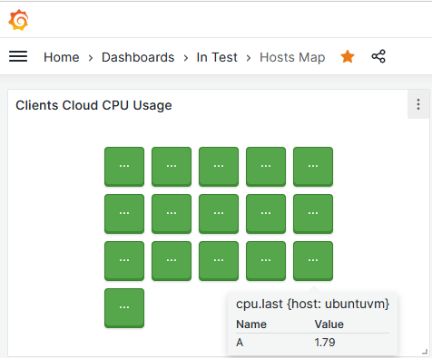

# Instalar Influxdb-client
root@test:~# apt install influxdb-client

## Queries
### Para contectarse
influx -host 192.168.xxx.xxx

O instalar client en Windows y generar config (En este caso estoy instalabo el cliente de v2.7 para manejar una base v1.8)

Luego de instalado, genero la config para conectarme a la base
.\influx config create --config-name Monitor --host-url http://192.168.11.60:8086 --active

### Ahora si, conectado desde una terminal Windows 
PS C:\Users\martin.cima\influxdb2-client-2.7.3> .\influx.exe v1 shell
InfluxQL Shell dev
Connected to InfluxDB OSS 1.8.10

###Notas
El cliente de Influx para linux, desde PowerShell permite el autocomplete y muestra la data de una forma mas "amigable"
EJ.:

SHOW DATABASES

Name: databases
┏━━━━━━━┳━━━━━━━━━━━━━┓
┃ index ┃    name     ┃
┣━━━━━━━╋━━━━━━━━━━━━━┫
┃      1┃_internal    ┃
┃      2┃telegraf     ┃
┃      3┃Clients      ┃
┃      4┃Infra        ┃
┃      5┃Clients_XLR  ┃
┣━━━━━━━┻━━━━━━━━━━━━━┫
┃   2 Columns, 5 Rows,┃
┃             Page 1/1┃
┃ Table 1/1, Statement┃
┃                  1/1┃
┗━━━━━━━━━━━━━━━━━━━━━┛

### Para hacer el test de conexion a la base (como tengo la config ya lista, solo tengo que invocar al comando)
PS C:\Users\martin.cima\influxdb2-client-2.7.3> .\influx.exe ping
OK

### Para Limpiar data (en este caso busco sacar la data de mi maquina, que use inicalmente para construir los dashboards)

> SHOW SERIES
key
---
cpu,cpu=cpu-total,dc=Cloud,host=LYCOMPANY-APP,os=Windows
cpu,cpu=cpu-total,dc=Cloud,host=MOLAJONI-APP,os=Windows
cpu,cpu=cpu-total,dc=Cloud,host=MOSCATELLI-ERP,os=Windows
cpu,cpu=cpu-total,dc=Cloud,host=NB-SVILUPPO99,os=Windows
cpu,cpu=cpu-total,dc=Cloud,host=SICAPP,os=Windows
cpu,cpu=cpu-total,dc=Cloud,host=boozers-app,os=Linux
cpu,cpu=cpu-total,dc=Cloud,host=gronchiapp,os=Windows
cpu,cpu=cpu-total,dc=Cloud,host=headuvm,os=Linux
cpu,cpu=cpu-total,dc=Cloud,host=ideapa-app,os=Linux
cpu,cpu=cpu-total,dc=Cloud,host=infolamp,os=Linux
cpu,cpu=cpu-total,dc=Cloud,host=infomonitor,os=Linux
cpu,cpu=cpu-total,dc=Cloud,host=lelodue-app,os=Linux
cpu,cpu=cpu-total,dc=Cloud,host=marcolinilinux,os=Linux
cpu,cpu=cpu-total,dc=Cloud,host=mecelp-app,os=Linux
cpu,cpu=cpu-total,dc=Cloud,host=moscatellilinux,os=Linux
cpu,cpu=cpu-total,dc=Cloud,host=santostefano-ec,os=Linux
cpu,cpu=cpu-total,dc=Cloud,host=test,os=Linux
cpu,cpu=cpu-total,dc=Cloud,host=ubuntuvm,os=Linux
cpu,cpu=cpu-total,dc=Cloud,host=zenithapp,os=Linux
cpu,cpu=cpu-total,dc=On-Prem,host=NB-SVILUPPO99,os=Windows
cpu,cpu=cpu0,dc=Cloud,host=LYCOMPANY-APP,os=Windows
cpu,cpu=cpu0,dc=Cloud,host=MOLAJONI-APP,os=Windows
cpu,cpu=cpu0,dc=Cloud,host=MOSCATELLI-ERP,os=Windows
cpu,cpu=cpu0,dc=Cloud,host=NB-SVILUPPO99,os=Windows
cpu,cpu=cpu0,dc=Cloud,host=SICAPP,os=Windows
cpu,cpu=cpu0,dc=Cloud,host=boozers-app,os=Linux
cpu,cpu=cpu0,dc=Cloud,host=gronchiapp,os=Windows
cpu,cpu=cpu0,dc=Cloud,host=headuvm,os=Linux
cpu,cpu=cpu0,dc=Cloud,host=ideapa-app,os=Linux
cpu,cpu=cpu0,dc=Cloud,host=infolamp,os=Linux
cpu,cpu=cpu0,dc=Cloud,host=infomonitor,os=Linux
cpu,cpu=cpu0,dc=Cloud,host=lelodue-app,os=Linux
cpu,cpu=cpu0,dc=Cloud,host=marcolinilinux,os=Linux
cpu,cpu=cpu0,dc=Cloud,host=mecelp-app,os=Linux
cpu,cpu=cpu0,dc=Cloud,host=moscatellilinux,os=Linux
cpu,cpu=cpu0,dc=Cloud,host=santostefano-ec,os=Linux
cpu,cpu=cpu0,dc=Cloud,host=test,os=Linux
cpu,cpu=cpu0,dc=Cloud,host=ubuntuvm,os=Linux
cpu,cpu=cpu0,dc=Cloud,host=zenithapp,os=Linux
cpu,cpu=cpu0,dc=On-Prem,host=NB-SVILUPPO99,os=Windows
cpu,cpu=cpu1,dc=Cloud,host=LYCOMPANY-APP,os=Windows
cpu,cpu=cpu1,dc=Cloud,host=MOLAJONI-APP,os=Windows
cpu,cpu=cpu1,dc=Cloud,host=MOSCATELLI-ERP,os=Windows
cpu,cpu=cpu1,dc=Cloud,host=NB-SVILUPPO99,os=Windows
cpu,cpu=cpu1,dc=Cloud,host=SICAPP,os=Windows
cpu,cpu=cpu1,dc=Cloud,host=boozers-app,os=Linux
cpu,cpu=cpu1,dc=Cloud,host=gronchiapp,os=Windows
cpu,cpu=cpu1,dc=Cloud,host=headuvm,os=Linux
cpu,cpu=cpu1,dc=Cloud,host=ideapa-app,os=Linux
cpu,cpu=cpu1,dc=Cloud,host=infomonitor,os=Linux
cpu,cpu=cpu1,dc=Cloud,host=lelodue-app,os=Linux
cpu,cpu=cpu1,dc=Cloud,host=marcolinilinux,os=Linux
cpu,cpu=cpu1,dc=Cloud,host=mecelp-app,os=Linux
cpu,cpu=cpu1,dc=Cloud,host=moscatellilinux,os=Linux
cpu,cpu=cpu1,dc=Cloud,host=santostefano-ec,os=Linux
cpu,cpu=cpu1,dc=Cloud,host=ubuntuvm,os=Linux
cpu,cpu=cpu1,dc=Cloud,host=zenithapp,os=Linux
cpu,cpu=cpu1,dc=On-Prem,host=NB-SVILUPPO99,os=Windows
cpu,cpu=cpu2,dc=Cloud,host=MOLAJONI-APP,os=Windows
cpu,cpu=cpu2,dc=Cloud,host=NB-SVILUPPO99,os=Windows
cpu,cpu=cpu2,dc=Cloud,host=headuvm,os=Linux
cpu,cpu=cpu2,dc=Cloud,host=ideapa-app,os=Linux
cpu,cpu=cpu2,dc=Cloud,host=infomonitor,os=Linux
cpu,cpu=cpu2,dc=Cloud,host=lelodue-app,os=Linux
cpu,cpu=cpu2,dc=Cloud,host=marcolinilinux,os=Linux
cpu,cpu=cpu2,dc=Cloud,host=santostefano-ec,os=Linux
cpu,cpu=cpu2,dc=Cloud,host=zenithapp,os=Linux
cpu,cpu=cpu2,dc=On-Prem,host=NB-SVILUPPO99,os=Windows
cpu,cpu=cpu3,dc=Cloud,host=MOLAJONI-APP,os=Windows
cpu,cpu=cpu3,dc=Cloud,host=NB-SVILUPPO99,os=Windows
cpu,cpu=cpu3,dc=Cloud,host=headuvm,os=Linux
cpu,cpu=cpu3,dc=Cloud,host=ideapa-app,os=Linux
cpu,cpu=cpu3,dc=Cloud,host=infomonitor,os=Linux
cpu,cpu=cpu3,dc=Cloud,host=lelodue-app,os=Linux
cpu,cpu=cpu3,dc=Cloud,host=marcolinilinux,os=Linux
cpu,cpu=cpu3,dc=Cloud,host=santostefano-ec,os=Linux
cpu,cpu=cpu3,dc=Cloud,host=zenithapp,os=Linux
cpu,cpu=cpu3,dc=On-Prem,host=NB-SVILUPPO99,os=Windows
cpu,cpu=cpu4,dc=Cloud,host=zenithapp,os=Linux
cpu,cpu=cpu5,dc=Cloud,host=zenithapp,os=Linux
cpu,cpu=cpu6,dc=Cloud,host=zenithapp,os=Linux
cpu,cpu=cpu7,dc=Cloud,host=zenithapp,os=Linux
disk,dc=Cloud,device=C:,fstype=NTFS,host=LYCOMPANY-APP,mode=rw,os=Windows,path=\C:
disk,dc=Cloud,device=C:,fstype=NTFS,host=MOLAJONI-APP,mode=rw,os=Windows,path=\C:
disk,dc=Cloud,device=C:,fstype=NTFS,host=MOSCATELLI-ERP,mode=rw,os=Windows,path=\C:
disk,dc=Cloud,device=C:,fstype=NTFS,host=NB-SVILUPPO99,mode=rw,os=Windows,path=\C:
disk,dc=Cloud,device=C:,fstype=NTFS,host=SICAPP,mode=rw,os=Windows,path=\C:
disk,dc=Cloud,device=C:,fstype=NTFS,host=gronchiapp,mode=rw,os=Windows,path=\C:
disk,dc=Cloud,device=D:,fstype=NTFS,host=LYCOMPANY-APP,mode=rw,os=Windows,path=\D:
disk,dc=Cloud,device=D:,fstype=NTFS,host=MOLAJONI-APP,mode=rw,os=Windows,path=\D:
disk,dc=Cloud,device=E:,fstype=NTFS,host=MOSCATELLI-ERP,mode=rw,os=Windows,path=\E:
disk,dc=Cloud,device=sda2,fstype=ext4,host=boozers-app,mode=rw,os=Linux,path=/
disk,dc=Cloud,device=sda2,fstype=ext4,host=headuvm,mode=rw,os=Linux,path=/
disk,dc=Cloud,device=sda2,fstype=ext4,host=ideapa-app,mode=rw,os=Linux,path=/
disk,dc=Cloud,device=sda2,fstype=ext4,host=infolamp,mode=rw,os=Linux,path=/
disk,dc=Cloud,device=sda2,fstype=ext4,host=infomonitor,mode=rw,os=Linux,path=/
disk,dc=Cloud,device=sda2,fstype=ext4,host=lelodue-app,mode=rw,os=Linux,path=/
disk,dc=Cloud,device=sda2,fstype=ext4,host=marcolinilinux,mode=rw,os=Linux,path=/
disk,dc=Cloud,device=sda2,fstype=ext4,host=mecelp-app,mode=rw,os=Linux,path=/
disk,dc=Cloud,device=sda2,fstype=ext4,host=moscatellilinux,mode=rw,os=Linux,path=/
disk,dc=Cloud,device=sda2,fstype=ext4,host=santostefano-ec,mode=rw,os=Linux,path=/
disk,dc=Cloud,device=sda2,fstype=ext4,host=test,mode=rw,os=Linux,path=/
disk,dc=Cloud,device=sda2,fstype=ext4,host=ubuntuvm,mode=rw,os=Linux,path=/
disk,dc=Cloud,device=sda2,fstype=ext4,host=zenithapp,mode=rw,os=Linux,path=/
disk,dc=Cloud,device=sdb,fstype=ext4,host=infomonitor,mode=rw,os=Linux,path=/var
disk,dc=On-Prem,device=C:,fstype=NTFS,host=NB-SVILUPPO99,mode=rw,os=Windows,path=\C:
kernel,dc=Cloud,host=boozers-app,os=Linux
kernel,dc=Cloud,host=headuvm,os=Linux
kernel,dc=Cloud,host=ideapa-app,os=Linux
kernel,dc=Cloud,host=infolamp,os=Linux
kernel,dc=Cloud,host=infomonitor,os=Linux
kernel,dc=Cloud,host=lelodue-app,os=Linux
kernel,dc=Cloud,host=marcolinilinux,os=Linux
kernel,dc=Cloud,host=mecelp-app,os=Linux
kernel,dc=Cloud,host=moscatellilinux,os=Linux
kernel,dc=Cloud,host=santostefano-ec,os=Linux
kernel,dc=Cloud,host=test,os=Linux
kernel,dc=Cloud,host=ubuntuvm,os=Linux
kernel,dc=Cloud,host=zenithapp,os=Linux
mem,dc=Cloud,host=LYCOMPANY-APP,os=Windows
mem,dc=Cloud,host=MOLAJONI-APP,os=Windows
mem,dc=Cloud,host=MOSCATELLI-ERP,os=Windows
mem,dc=Cloud,host=NB-SVILUPPO99,os=Windows
mem,dc=Cloud,host=SICAPP,os=Windows
mem,dc=Cloud,host=boozers-app,os=Linux
mem,dc=Cloud,host=gronchiapp,os=Windows
mem,dc=Cloud,host=headuvm,os=Linux
mem,dc=Cloud,host=ideapa-app,os=Linux
mem,dc=Cloud,host=infolamp,os=Linux
mem,dc=Cloud,host=infomonitor,os=Linux
mem,dc=Cloud,host=lelodue-app,os=Linux
mem,dc=Cloud,host=marcolinilinux,os=Linux
mem,dc=Cloud,host=mecelp-app,os=Linux
mem,dc=Cloud,host=moscatellilinux,os=Linux
mem,dc=Cloud,host=santostefano-ec,os=Linux
mem,dc=Cloud,host=test,os=Linux
mem,dc=Cloud,host=ubuntuvm,os=Linux
mem,dc=Cloud,host=zenithapp,os=Linux
mem,dc=On-Prem,host=NB-SVILUPPO99,os=Windows
net,dc=Cloud,host=LYCOMPANY-APP,interface=Ethernet0\ 2,os=Windows
net,dc=Cloud,host=MOLAJONI-APP,interface=Ethernet0\ 2,os=Windows
net,dc=Cloud,host=MOSCATELLI-ERP,interface=Ethernet0\ 2,os=Windows
net,dc=Cloud,host=NB-SVILUPPO99,interface=VirtualBox\ Host-Only\ Network\ #2,os=Windows
net,dc=Cloud,host=NB-SVILUPPO99,interface=Wi-Fi,os=Windows
net,dc=Cloud,host=SICAPP,interface=Ethernet0\ 2,os=Windows
net,dc=Cloud,host=boozers-app,interface=all,os=Linux
net,dc=Cloud,host=boozers-app,interface=ens192,os=Linux
net,dc=Cloud,host=gronchiapp,interface=Ethernet0\ 4,os=Windows
net,dc=Cloud,host=headuvm,interface=all,os=Linux
net,dc=Cloud,host=headuvm,interface=ens192,os=Linux
net,dc=Cloud,host=ideapa-app,interface=all,os=Linux
net,dc=Cloud,host=ideapa-app,interface=ens192,os=Linux
net,dc=Cloud,host=infolamp,interface=all,os=Linux
net,dc=Cloud,host=infolamp,interface=ens192,os=Linux
net,dc=Cloud,host=infomonitor,interface=all,os=Linux
net,dc=Cloud,host=infomonitor,interface=ens160,os=Linux
net,dc=Cloud,host=lelodue-app,interface=all,os=Linux
net,dc=Cloud,host=lelodue-app,interface=ens192,os=Linux
net,dc=Cloud,host=marcolinilinux,interface=all,os=Linux
net,dc=Cloud,host=marcolinilinux,interface=ens160,os=Linux
net,dc=Cloud,host=mecelp-app,interface=all,os=Linux
net,dc=Cloud,host=mecelp-app,interface=ens192,os=Linux
net,dc=Cloud,host=moscatellilinux,interface=all,os=Linux
net,dc=Cloud,host=moscatellilinux,interface=ens160,os=Linux
net,dc=Cloud,host=santostefano-ec,interface=all,os=Linux
net,dc=Cloud,host=santostefano-ec,interface=ens192,os=Linux
net,dc=Cloud,host=test,interface=all,os=Linux
net,dc=Cloud,host=test,interface=ens160,os=Linux
net,dc=Cloud,host=ubuntuvm,interface=all,os=Linux
net,dc=Cloud,host=ubuntuvm,interface=ens160,os=Linux
net,dc=Cloud,host=zenithapp,interface=all,os=Linux
net,dc=Cloud,host=zenithapp,interface=ens192,os=Linux
net,dc=On-Prem,host=NB-SVILUPPO99,interface=VirtualBox\ Host-Only\ Network\ #2,os=Windows
net,dc=On-Prem,host=NB-SVILUPPO99,interface=Wi-Fi,os=Windows
processes,dc=Cloud,host=boozers-app,os=Linux
processes,dc=Cloud,host=headuvm,os=Linux
processes,dc=Cloud,host=ideapa-app,os=Linux
processes,dc=Cloud,host=infolamp,os=Linux
processes,dc=Cloud,host=infomonitor,os=Linux
processes,dc=Cloud,host=lelodue-app,os=Linux
processes,dc=Cloud,host=marcolinilinux,os=Linux
processes,dc=Cloud,host=mecelp-app,os=Linux
processes,dc=Cloud,host=moscatellilinux,os=Linux
processes,dc=Cloud,host=santostefano-ec,os=Linux
processes,dc=Cloud,host=test,os=Linux
processes,dc=Cloud,host=ubuntuvm,os=Linux
processes,dc=Cloud,host=zenithapp,os=Linux
swap,dc=Cloud,host=LYCOMPANY-APP,os=Windows
swap,dc=Cloud,host=MOLAJONI-APP,os=Windows
swap,dc=Cloud,host=MOSCATELLI-ERP,os=Windows
swap,dc=Cloud,host=NB-SVILUPPO99,os=Windows
swap,dc=Cloud,host=SICAPP,os=Windows
swap,dc=Cloud,host=boozers-app,os=Linux
swap,dc=Cloud,host=gronchiapp,os=Windows
swap,dc=Cloud,host=headuvm,os=Linux
swap,dc=Cloud,host=ideapa-app,os=Linux
swap,dc=Cloud,host=infolamp,os=Linux
swap,dc=Cloud,host=infomonitor,os=Linux
swap,dc=Cloud,host=lelodue-app,os=Linux
swap,dc=Cloud,host=marcolinilinux,os=Linux
swap,dc=Cloud,host=mecelp-app,os=Linux
swap,dc=Cloud,host=moscatellilinux,os=Linux
swap,dc=Cloud,host=santostefano-ec,os=Linux
swap,dc=Cloud,host=test,os=Linux
swap,dc=Cloud,host=ubuntuvm,os=Linux
swap,dc=Cloud,host=zenithapp,os=Linux
swap,dc=On-Prem,host=NB-SVILUPPO99,os=Windows
system,dc=Cloud,host=LYCOMPANY-APP,os=Windows
system,dc=Cloud,host=MOLAJONI-APP,os=Windows
system,dc=Cloud,host=MOSCATELLI-ERP,os=Windows
system,dc=Cloud,host=NB-SVILUPPO99,os=Windows
system,dc=Cloud,host=SICAPP,os=Windows
system,dc=Cloud,host=boozers-app,os=Linux
system,dc=Cloud,host=gronchiapp,os=Windows
system,dc=Cloud,host=headuvm,os=Linux
system,dc=Cloud,host=ideapa-app,os=Linux
system,dc=Cloud,host=infolamp,os=Linux
system,dc=Cloud,host=infomonitor,os=Linux
system,dc=Cloud,host=lelodue-app,os=Linux
system,dc=Cloud,host=marcolinilinux,os=Linux
system,dc=Cloud,host=mecelp-app,os=Linux
system,dc=Cloud,host=moscatellilinux,os=Linux
system,dc=Cloud,host=santostefano-ec,os=Linux
system,dc=Cloud,host=test,os=Linux
system,dc=Cloud,host=ubuntuvm,os=Linux
system,dc=Cloud,host=zenithapp,os=Linux
system,dc=On-Prem,host=NB-SVILUPPO99,os=Windows

###################
Limpiando la data
###################

 SHOW SERIES WHERE "host" ='NB-SVILUPPO99'
key
---
cpu,cpu=cpu-total,dc=Cloud,host=NB-SVILUPPO99,os=Windows
cpu,cpu=cpu-total,dc=On-Prem,host=NB-SVILUPPO99,os=Windows
cpu,cpu=cpu0,dc=Cloud,host=NB-SVILUPPO99,os=Windows
cpu,cpu=cpu0,dc=On-Prem,host=NB-SVILUPPO99,os=Windows
cpu,cpu=cpu1,dc=Cloud,host=NB-SVILUPPO99,os=Windows
cpu,cpu=cpu1,dc=On-Prem,host=NB-SVILUPPO99,os=Windows
cpu,cpu=cpu2,dc=Cloud,host=NB-SVILUPPO99,os=Windows
cpu,cpu=cpu2,dc=On-Prem,host=NB-SVILUPPO99,os=Windows
cpu,cpu=cpu3,dc=Cloud,host=NB-SVILUPPO99,os=Windows
cpu,cpu=cpu3,dc=On-Prem,host=NB-SVILUPPO99,os=Windows
disk,dc=Cloud,device=C:,fstype=NTFS,host=NB-SVILUPPO99,mode=rw,os=Windows,path=\C:
disk,dc=On-Prem,device=C:,fstype=NTFS,host=NB-SVILUPPO99,mode=rw,os=Windows,path=\C:
mem,dc=Cloud,host=NB-SVILUPPO99,os=Windows
mem,dc=On-Prem,host=NB-SVILUPPO99,os=Windows
net,dc=Cloud,host=NB-SVILUPPO99,interface=VirtualBox\ Host-Only\ Network\ #2,os=Windows
net,dc=Cloud,host=NB-SVILUPPO99,interface=Wi-Fi,os=Windows
net,dc=On-Prem,host=NB-SVILUPPO99,interface=VirtualBox\ Host-Only\ Network\ #2,os=Windows
net,dc=On-Prem,host=NB-SVILUPPO99,interface=Wi-Fi,os=Windows
swap,dc=Cloud,host=NB-SVILUPPO99,os=Windows
swap,dc=On-Prem,host=NB-SVILUPPO99,os=Windows
system,dc=Cloud,host=NB-SVILUPPO99,os=Windows
system,dc=On-Prem,host=NB-SVILUPPO99,os=Windows
> DELETE  WHERE "host" ='NB-SVILUPPO99'
> SHOW SERIES WHERE "host" ='NB-SVILUPPO99'

### Para mover data de una base a otra 

#####################################
Pruebas del Viernes 18/08/2023
####################################

Quise mover la data del server que monitorea ya que no pertenece al ambiente Cloud, sino al On-Prem ademas que no califica como CLiente
Pero.... No funciono, al final esta la respuesta :P

> SHOW SERIES
key
---
cpu,cpu=cpu-total,dc=Cloud,host=LYCOMPANY-APP,os=Windows
cpu,cpu=cpu-total,dc=Cloud,host=MOLAJONI-APP,os=Windows
cpu,cpu=cpu-total,dc=Cloud,host=MOSCATELLI-ERP,os=Windows
cpu,cpu=cpu-total,dc=Cloud,host=NB-SVILUPPO99,os=Windows
cpu,cpu=cpu-total,dc=Cloud,host=SICAPP,os=Windows
cpu,cpu=cpu-total,dc=Cloud,host=boozers-app,os=Linux
cpu,cpu=cpu-total,dc=Cloud,host=gronchiapp,os=Windows
cpu,cpu=cpu-total,dc=Cloud,host=headuvm,os=Linux
cpu,cpu=cpu-total,dc=Cloud,host=ideapa-app,os=Linux
cpu,cpu=cpu-total,dc=Cloud,host=infolamp,os=Linux
cpu,cpu=cpu-total,dc=Cloud,host=infomonitor,os=Linux
cpu,cpu=cpu-total,dc=Cloud,host=lelodue-app,os=Linux
cpu,cpu=cpu-total,dc=Cloud,host=marcolinilinux,os=Linux
cpu,cpu=cpu-total,dc=Cloud,host=mecelp-app,os=Linux
cpu,cpu=cpu-total,dc=Cloud,host=moscatellilinux,os=Linux
cpu,cpu=cpu-total,dc=Cloud,host=santostefano-ec,os=Linux
cpu,cpu=cpu-total,dc=Cloud,host=test,os=Linux
cpu,cpu=cpu-total,dc=Cloud,host=ubuntuvm,os=Linux
cpu,cpu=cpu-total,dc=Cloud,host=zenithapp,os=Linux
cpu,cpu=cpu-total,dc=On-Prem,host=NB-SVILUPPO99,os=Windows
cpu,cpu=cpu0,dc=Cloud,host=LYCOMPANY-APP,os=Windows
cpu,cpu=cpu0,dc=Cloud,host=MOLAJONI-APP,os=Windows
cpu,cpu=cpu0,dc=Cloud,host=MOSCATELLI-ERP,os=Windows
cpu,cpu=cpu0,dc=Cloud,host=NB-SVILUPPO99,os=Windows
cpu,cpu=cpu0,dc=Cloud,host=SICAPP,os=Windows
cpu,cpu=cpu0,dc=Cloud,host=boozers-app,os=Linux
cpu,cpu=cpu0,dc=Cloud,host=gronchiapp,os=Windows
cpu,cpu=cpu0,dc=Cloud,host=headuvm,os=Linux
cpu,cpu=cpu0,dc=Cloud,host=ideapa-app,os=Linux
cpu,cpu=cpu0,dc=Cloud,host=infolamp,os=Linux
cpu,cpu=cpu0,dc=Cloud,host=infomonitor,os=Linux
cpu,cpu=cpu0,dc=Cloud,host=lelodue-app,os=Linux
cpu,cpu=cpu0,dc=Cloud,host=marcolinilinux,os=Linux
cpu,cpu=cpu0,dc=Cloud,host=mecelp-app,os=Linux
cpu,cpu=cpu0,dc=Cloud,host=moscatellilinux,os=Linux
cpu,cpu=cpu0,dc=Cloud,host=santostefano-ec,os=Linux
cpu,cpu=cpu0,dc=Cloud,host=test,os=Linux
cpu,cpu=cpu0,dc=Cloud,host=ubuntuvm,os=Linux
cpu,cpu=cpu0,dc=Cloud,host=zenithapp,os=Linux
cpu,cpu=cpu0,dc=On-Prem,host=NB-SVILUPPO99,os=Windows
cpu,cpu=cpu1,dc=Cloud,host=LYCOMPANY-APP,os=Windows
cpu,cpu=cpu1,dc=Cloud,host=MOLAJONI-APP,os=Windows
cpu,cpu=cpu1,dc=Cloud,host=MOSCATELLI-ERP,os=Windows
cpu,cpu=cpu1,dc=Cloud,host=NB-SVILUPPO99,os=Windows
cpu,cpu=cpu1,dc=Cloud,host=SICAPP,os=Windows
cpu,cpu=cpu1,dc=Cloud,host=boozers-app,os=Linux
cpu,cpu=cpu1,dc=Cloud,host=gronchiapp,os=Windows
cpu,cpu=cpu1,dc=Cloud,host=headuvm,os=Linux
cpu,cpu=cpu1,dc=Cloud,host=ideapa-app,os=Linux
cpu,cpu=cpu1,dc=Cloud,host=infomonitor,os=Linux
cpu,cpu=cpu1,dc=Cloud,host=lelodue-app,os=Linux
cpu,cpu=cpu1,dc=Cloud,host=marcolinilinux,os=Linux
cpu,cpu=cpu1,dc=Cloud,host=mecelp-app,os=Linux
cpu,cpu=cpu1,dc=Cloud,host=moscatellilinux,os=Linux
cpu,cpu=cpu1,dc=Cloud,host=santostefano-ec,os=Linux
cpu,cpu=cpu1,dc=Cloud,host=ubuntuvm,os=Linux
cpu,cpu=cpu1,dc=Cloud,host=zenithapp,os=Linux
cpu,cpu=cpu1,dc=On-Prem,host=NB-SVILUPPO99,os=Windows
cpu,cpu=cpu2,dc=Cloud,host=MOLAJONI-APP,os=Windows
cpu,cpu=cpu2,dc=Cloud,host=NB-SVILUPPO99,os=Windows
cpu,cpu=cpu2,dc=Cloud,host=headuvm,os=Linux
cpu,cpu=cpu2,dc=Cloud,host=ideapa-app,os=Linux
cpu,cpu=cpu2,dc=Cloud,host=infomonitor,os=Linux
cpu,cpu=cpu2,dc=Cloud,host=lelodue-app,os=Linux
cpu,cpu=cpu2,dc=Cloud,host=marcolinilinux,os=Linux
cpu,cpu=cpu2,dc=Cloud,host=santostefano-ec,os=Linux
cpu,cpu=cpu2,dc=Cloud,host=zenithapp,os=Linux
cpu,cpu=cpu2,dc=On-Prem,host=NB-SVILUPPO99,os=Windows
cpu,cpu=cpu3,dc=Cloud,host=MOLAJONI-APP,os=Windows
cpu,cpu=cpu3,dc=Cloud,host=NB-SVILUPPO99,os=Windows
cpu,cpu=cpu3,dc=Cloud,host=headuvm,os=Linux
cpu,cpu=cpu3,dc=Cloud,host=ideapa-app,os=Linux
cpu,cpu=cpu3,dc=Cloud,host=infomonitor,os=Linux
cpu,cpu=cpu3,dc=Cloud,host=lelodue-app,os=Linux
cpu,cpu=cpu3,dc=Cloud,host=marcolinilinux,os=Linux
cpu,cpu=cpu3,dc=Cloud,host=santostefano-ec,os=Linux
cpu,cpu=cpu3,dc=Cloud,host=zenithapp,os=Linux
cpu,cpu=cpu3,dc=On-Prem,host=NB-SVILUPPO99,os=Windows
cpu,cpu=cpu4,dc=Cloud,host=zenithapp,os=Linux
cpu,cpu=cpu5,dc=Cloud,host=zenithapp,os=Linux
cpu,cpu=cpu6,dc=Cloud,host=zenithapp,os=Linux
cpu,cpu=cpu7,dc=Cloud,host=zenithapp,os=Linux
disk,dc=Cloud,device=C:,fstype=NTFS,host=LYCOMPANY-APP,mode=rw,os=Windows,path=\C:
disk,dc=Cloud,device=C:,fstype=NTFS,host=MOLAJONI-APP,mode=rw,os=Windows,path=\C:
disk,dc=Cloud,device=C:,fstype=NTFS,host=MOSCATELLI-ERP,mode=rw,os=Windows,path=\C:
disk,dc=Cloud,device=C:,fstype=NTFS,host=NB-SVILUPPO99,mode=rw,os=Windows,path=\C:
disk,dc=Cloud,device=C:,fstype=NTFS,host=SICAPP,mode=rw,os=Windows,path=\C:
disk,dc=Cloud,device=C:,fstype=NTFS,host=gronchiapp,mode=rw,os=Windows,path=\C:
disk,dc=Cloud,device=D:,fstype=NTFS,host=LYCOMPANY-APP,mode=rw,os=Windows,path=\D:
disk,dc=Cloud,device=D:,fstype=NTFS,host=MOLAJONI-APP,mode=rw,os=Windows,path=\D:
disk,dc=Cloud,device=E:,fstype=NTFS,host=MOSCATELLI-ERP,mode=rw,os=Windows,path=\E:
disk,dc=Cloud,device=sda2,fstype=ext4,host=boozers-app,mode=rw,os=Linux,path=/
disk,dc=Cloud,device=sda2,fstype=ext4,host=headuvm,mode=rw,os=Linux,path=/
disk,dc=Cloud,device=sda2,fstype=ext4,host=ideapa-app,mode=rw,os=Linux,path=/
disk,dc=Cloud,device=sda2,fstype=ext4,host=infolamp,mode=rw,os=Linux,path=/
disk,dc=Cloud,device=sda2,fstype=ext4,host=infomonitor,mode=rw,os=Linux,path=/
disk,dc=Cloud,device=sda2,fstype=ext4,host=lelodue-app,mode=rw,os=Linux,path=/
disk,dc=Cloud,device=sda2,fstype=ext4,host=marcolinilinux,mode=rw,os=Linux,path=/
disk,dc=Cloud,device=sda2,fstype=ext4,host=mecelp-app,mode=rw,os=Linux,path=/
disk,dc=Cloud,device=sda2,fstype=ext4,host=moscatellilinux,mode=rw,os=Linux,path=/
disk,dc=Cloud,device=sda2,fstype=ext4,host=santostefano-ec,mode=rw,os=Linux,path=/
disk,dc=Cloud,device=sda2,fstype=ext4,host=test,mode=rw,os=Linux,path=/
disk,dc=Cloud,device=sda2,fstype=ext4,host=ubuntuvm,mode=rw,os=Linux,path=/
disk,dc=Cloud,device=sda2,fstype=ext4,host=zenithapp,mode=rw,os=Linux,path=/
disk,dc=Cloud,device=sdb,fstype=ext4,host=infomonitor,mode=rw,os=Linux,path=/var
disk,dc=On-Prem,device=C:,fstype=NTFS,host=NB-SVILUPPO99,mode=rw,os=Windows,path=\C:
kernel,dc=Cloud,host=boozers-app,os=Linux
kernel,dc=Cloud,host=headuvm,os=Linux
kernel,dc=Cloud,host=ideapa-app,os=Linux
kernel,dc=Cloud,host=infolamp,os=Linux
kernel,dc=Cloud,host=infomonitor,os=Linux
kernel,dc=Cloud,host=lelodue-app,os=Linux
kernel,dc=Cloud,host=marcolinilinux,os=Linux
kernel,dc=Cloud,host=mecelp-app,os=Linux
kernel,dc=Cloud,host=moscatellilinux,os=Linux
kernel,dc=Cloud,host=santostefano-ec,os=Linux
kernel,dc=Cloud,host=test,os=Linux
kernel,dc=Cloud,host=ubuntuvm,os=Linux
kernel,dc=Cloud,host=zenithapp,os=Linux
mem,dc=Cloud,host=LYCOMPANY-APP,os=Windows
mem,dc=Cloud,host=MOLAJONI-APP,os=Windows
mem,dc=Cloud,host=MOSCATELLI-ERP,os=Windows
mem,dc=Cloud,host=NB-SVILUPPO99,os=Windows
mem,dc=Cloud,host=SICAPP,os=Windows
mem,dc=Cloud,host=boozers-app,os=Linux
mem,dc=Cloud,host=gronchiapp,os=Windows
mem,dc=Cloud,host=headuvm,os=Linux
mem,dc=Cloud,host=ideapa-app,os=Linux
mem,dc=Cloud,host=infolamp,os=Linux
mem,dc=Cloud,host=infomonitor,os=Linux
mem,dc=Cloud,host=lelodue-app,os=Linux
mem,dc=Cloud,host=marcolinilinux,os=Linux
mem,dc=Cloud,host=mecelp-app,os=Linux
mem,dc=Cloud,host=moscatellilinux,os=Linux
mem,dc=Cloud,host=santostefano-ec,os=Linux
mem,dc=Cloud,host=test,os=Linux
mem,dc=Cloud,host=ubuntuvm,os=Linux
mem,dc=Cloud,host=zenithapp,os=Linux
mem,dc=On-Prem,host=NB-SVILUPPO99,os=Windows
net,dc=Cloud,host=LYCOMPANY-APP,interface=Ethernet0\ 2,os=Windows
net,dc=Cloud,host=MOLAJONI-APP,interface=Ethernet0\ 2,os=Windows
net,dc=Cloud,host=MOSCATELLI-ERP,interface=Ethernet0\ 2,os=Windows
net,dc=Cloud,host=NB-SVILUPPO99,interface=VirtualBox\ Host-Only\ Network\ #2,os=Windows
net,dc=Cloud,host=NB-SVILUPPO99,interface=Wi-Fi,os=Windows
net,dc=Cloud,host=SICAPP,interface=Ethernet0\ 2,os=Windows
net,dc=Cloud,host=boozers-app,interface=all,os=Linux
net,dc=Cloud,host=boozers-app,interface=ens192,os=Linux
net,dc=Cloud,host=gronchiapp,interface=Ethernet0\ 4,os=Windows
net,dc=Cloud,host=headuvm,interface=all,os=Linux
net,dc=Cloud,host=headuvm,interface=ens192,os=Linux
net,dc=Cloud,host=ideapa-app,interface=all,os=Linux
net,dc=Cloud,host=ideapa-app,interface=ens192,os=Linux
net,dc=Cloud,host=infolamp,interface=all,os=Linux
net,dc=Cloud,host=infolamp,interface=ens192,os=Linux
net,dc=Cloud,host=infomonitor,interface=all,os=Linux
net,dc=Cloud,host=infomonitor,interface=ens160,os=Linux
net,dc=Cloud,host=lelodue-app,interface=all,os=Linux
net,dc=Cloud,host=lelodue-app,interface=ens192,os=Linux
net,dc=Cloud,host=marcolinilinux,interface=all,os=Linux
net,dc=Cloud,host=marcolinilinux,interface=ens160,os=Linux
net,dc=Cloud,host=mecelp-app,interface=all,os=Linux
net,dc=Cloud,host=mecelp-app,interface=ens192,os=Linux
net,dc=Cloud,host=moscatellilinux,interface=all,os=Linux
net,dc=Cloud,host=moscatellilinux,interface=ens160,os=Linux
net,dc=Cloud,host=santostefano-ec,interface=all,os=Linux
net,dc=Cloud,host=santostefano-ec,interface=ens192,os=Linux
net,dc=Cloud,host=test,interface=all,os=Linux
net,dc=Cloud,host=test,interface=ens160,os=Linux
net,dc=Cloud,host=ubuntuvm,interface=all,os=Linux
net,dc=Cloud,host=ubuntuvm,interface=ens160,os=Linux
net,dc=Cloud,host=zenithapp,interface=all,os=Linux
net,dc=Cloud,host=zenithapp,interface=ens192,os=Linux
net,dc=On-Prem,host=NB-SVILUPPO99,interface=VirtualBox\ Host-Only\ Network\ #2,os=Windows
net,dc=On-Prem,host=NB-SVILUPPO99,interface=Wi-Fi,os=Windows
processes,dc=Cloud,host=boozers-app,os=Linux
processes,dc=Cloud,host=headuvm,os=Linux
processes,dc=Cloud,host=ideapa-app,os=Linux
processes,dc=Cloud,host=infolamp,os=Linux
processes,dc=Cloud,host=infomonitor,os=Linux
processes,dc=Cloud,host=lelodue-app,os=Linux
processes,dc=Cloud,host=marcolinilinux,os=Linux
processes,dc=Cloud,host=mecelp-app,os=Linux
processes,dc=Cloud,host=moscatellilinux,os=Linux
processes,dc=Cloud,host=santostefano-ec,os=Linux
processes,dc=Cloud,host=test,os=Linux
processes,dc=Cloud,host=ubuntuvm,os=Linux
processes,dc=Cloud,host=zenithapp,os=Linux
swap,dc=Cloud,host=LYCOMPANY-APP,os=Windows
swap,dc=Cloud,host=MOLAJONI-APP,os=Windows
swap,dc=Cloud,host=MOSCATELLI-ERP,os=Windows
swap,dc=Cloud,host=NB-SVILUPPO99,os=Windows
swap,dc=Cloud,host=SICAPP,os=Windows
swap,dc=Cloud,host=boozers-app,os=Linux
swap,dc=Cloud,host=gronchiapp,os=Windows
swap,dc=Cloud,host=headuvm,os=Linux
swap,dc=Cloud,host=ideapa-app,os=Linux
swap,dc=Cloud,host=infolamp,os=Linux
swap,dc=Cloud,host=infomonitor,os=Linux
swap,dc=Cloud,host=lelodue-app,os=Linux
swap,dc=Cloud,host=marcolinilinux,os=Linux
swap,dc=Cloud,host=mecelp-app,os=Linux
swap,dc=Cloud,host=moscatellilinux,os=Linux
swap,dc=Cloud,host=santostefano-ec,os=Linux
swap,dc=Cloud,host=test,os=Linux
swap,dc=Cloud,host=ubuntuvm,os=Linux
swap,dc=Cloud,host=zenithapp,os=Linux
swap,dc=On-Prem,host=NB-SVILUPPO99,os=Windows
system,dc=Cloud,host=LYCOMPANY-APP,os=Windows
system,dc=Cloud,host=MOLAJONI-APP,os=Windows
system,dc=Cloud,host=MOSCATELLI-ERP,os=Windows
system,dc=Cloud,host=NB-SVILUPPO99,os=Windows
system,dc=Cloud,host=SICAPP,os=Windows
system,dc=Cloud,host=boozers-app,os=Linux
system,dc=Cloud,host=gronchiapp,os=Windows
system,dc=Cloud,host=headuvm,os=Linux
system,dc=Cloud,host=ideapa-app,os=Linux
system,dc=Cloud,host=infolamp,os=Linux
system,dc=Cloud,host=infomonitor,os=Linux
system,dc=Cloud,host=lelodue-app,os=Linux
system,dc=Cloud,host=marcolinilinux,os=Linux
system,dc=Cloud,host=mecelp-app,os=Linux
system,dc=Cloud,host=moscatellilinux,os=Linux
system,dc=Cloud,host=santostefano-ec,os=Linux
system,dc=Cloud,host=test,os=Linux
system,dc=Cloud,host=ubuntuvm,os=Linux
system,dc=Cloud,host=zenithapp,os=Linux
system,dc=On-Prem,host=NB-SVILUPPO99,os=Windows

###################
Limpiando la data
###################

 SHOW SERIES WHERE "host" ='NB-SVILUPPO99'
key
---
cpu,cpu=cpu-total,dc=Cloud,host=NB-SVILUPPO99,os=Windows
cpu,cpu=cpu-total,dc=On-Prem,host=NB-SVILUPPO99,os=Windows
cpu,cpu=cpu0,dc=Cloud,host=NB-SVILUPPO99,os=Windows
cpu,cpu=cpu0,dc=On-Prem,host=NB-SVILUPPO99,os=Windows
cpu,cpu=cpu1,dc=Cloud,host=NB-SVILUPPO99,os=Windows
cpu,cpu=cpu1,dc=On-Prem,host=NB-SVILUPPO99,os=Windows
cpu,cpu=cpu2,dc=Cloud,host=NB-SVILUPPO99,os=Windows
cpu,cpu=cpu2,dc=On-Prem,host=NB-SVILUPPO99,os=Windows
cpu,cpu=cpu3,dc=Cloud,host=NB-SVILUPPO99,os=Windows
cpu,cpu=cpu3,dc=On-Prem,host=NB-SVILUPPO99,os=Windows
disk,dc=Cloud,device=C:,fstype=NTFS,host=NB-SVILUPPO99,mode=rw,os=Windows,path=\C:
disk,dc=On-Prem,device=C:,fstype=NTFS,host=NB-SVILUPPO99,mode=rw,os=Windows,path=\C:
mem,dc=Cloud,host=NB-SVILUPPO99,os=Windows
mem,dc=On-Prem,host=NB-SVILUPPO99,os=Windows
net,dc=Cloud,host=NB-SVILUPPO99,interface=VirtualBox\ Host-Only\ Network\ #2,os=Windows
net,dc=Cloud,host=NB-SVILUPPO99,interface=Wi-Fi,os=Windows
net,dc=On-Prem,host=NB-SVILUPPO99,interface=VirtualBox\ Host-Only\ Network\ #2,os=Windows
net,dc=On-Prem,host=NB-SVILUPPO99,interface=Wi-Fi,os=Windows
swap,dc=Cloud,host=NB-SVILUPPO99,os=Windows
swap,dc=On-Prem,host=NB-SVILUPPO99,os=Windows
system,dc=Cloud,host=NB-SVILUPPO99,os=Windows
system,dc=On-Prem,host=NB-SVILUPPO99,os=Windows
> DELETE  WHERE "host" ='NB-SVILUPPO99'
> SHOW SERIES WHERE "host" ='NB-SVILUPPO99'
>
>
###################

show MEASUREMENTS

SELECT * from cpu LIMIT 5

SHOW MEASUREMENTS WHERE "host" = 'infomonitor'

select * from cpu where "host" = 'infomonitor' LIMIT 5

select "cpu","disk","kernel","mem","net","processes","swap","system" WHERE "host"='infomonitor' LIMIT 10

########### Exploracion de la base ##################

SHOW DATABASES
> SHOW RETENTION POLICIES ON Clients
> SHOW RETENTION POLICIES
> SHOW SERIES
> SHOW SERIES

┏━━━━━━━┳━━━━━━━━━━━━━━━━━━━━━━━━━━━━━━━━━━━━━━━━━━━━━━━━━━━━━━━━━━━━━━━━━━━━━━━━━━━━━━━━━━━━━┓
┃ index ┃                                         key                                         ┃
┣━━━━━━━╋━━━━━━━━━━━━━━━━━━━━━━━━━━━━━━━━━━━━━━━━━━━━━━━━━━━━━━━━━━━━━━━━━━━━━━━━━━━━━━━━━━━━━┫
┃      1┃cpu,cpu=cpu-total,dc=Cloud,host=LYCOMPANY-APP,os=Windows                             ┃
┃      2┃cpu,cpu=cpu-total,dc=Cloud,host=MOLAJONI-APP,os=Windows                              ┃
┃      3┃cpu,cpu=cpu-total,dc=Cloud,host=MOSCATELLI-ERP,os=Windows                            ┃
┃      4┃cpu,cpu=cpu-total,dc=Cloud,host=SICAPP,os=Windows                                    ┃
┃      5┃cpu,cpu=cpu-total,dc=Cloud,host=boozers-app,os=Linux                                 ┃
┃      6┃cpu,cpu=cpu-total,dc=Cloud,host=gronchiapp,os=Windows                                ┃
┃      7┃cpu,cpu=cpu-total,dc=Cloud,host=headuvm,os=Linux                                     ┃
┃      8┃cpu,cpu=cpu-total,dc=Cloud,host=ideapa-app,os=Linux                                  ┃
┃      9┃cpu,cpu=cpu-total,dc=Cloud,host=infolamp,os=Linux                                    ┃
┃     10┃cpu,cpu=cpu-total,dc=Cloud,host=infomonitor,os=Linux                                 ┃
┃     11┃cpu,cpu=cpu-total,dc=Cloud,host=lelodue-app,os=Linux                                 ┃
┃     12┃cpu,cpu=cpu-total,dc=Cloud,host=marcolinilinux,os=Linux                              ┃
┃     13┃cpu,cpu=cpu-total,dc=Cloud,host=mecelp-app,os=Linux                                  ┃
┃     14┃cpu,cpu=cpu-total,dc=Cloud,host=moscatellilinux,os=Linux                             ┃
┃     15┃cpu,cpu=cpu-total,dc=Cloud,host=santostefano-ec,os=Linux                             ┃
┃     16┃cpu,cpu=cpu-total,dc=Cloud,host=ubuntuvm,os=Linux                                    ┃
┃     17┃cpu,cpu=cpu-total,dc=Cloud,host=zenithapp,os=Linux                                   ┃
┃     18┃cpu,cpu=cpu0,dc=Cloud,host=LYCOMPANY-APP,os=Windows                                  ┃
┃     19┃cpu,cpu=cpu0,dc=Cloud,host=MOLAJONI-APP,os=Windows                                   ┃
┃     20┃cpu,cpu=cpu0,dc=Cloud,host=MOSCATELLI-ERP,os=Windows                                 ┃
┃     21┃cpu,cpu=cpu0,dc=Cloud,host=SICAPP,os=Windows                                         ┃
┃     22┃cpu,cpu=cpu0,dc=Cloud,host=boozers-app,os=Linux                                      ┃
┃     23┃cpu,cpu=cpu0,dc=Cloud,host=gronchiapp,os=Windows                                     ┃
┃     24┃cpu,cpu=cpu0,dc=Cloud,host=headuvm,os=Linux                                          ┃
┃     25┃cpu,cpu=cpu0,dc=Cloud,host=ideapa-app,os=Linux                                       ┃
┃     26┃cpu,cpu=cpu0,dc=Cloud,host=infolamp,os=Linux                                         ┃
┃     27┃cpu,cpu=cpu0,dc=Cloud,host=infomonitor,os=Linux                                      ┃
┃     28┃cpu,cpu=cpu0,dc=Cloud,host=lelodue-app,os=Linux                                      ┃
┃     29┃cpu,cpu=cpu0,dc=Cloud,host=marcolinilinux,os=Linux                                   ┃
┃     30┃cpu,cpu=cpu0,dc=Cloud,host=mecelp-app,os=Linux                                       ┃
┃     31┃cpu,cpu=cpu0,dc=Cloud,host=moscatellilinux,os=Linux                                  ┃
┃     32┃cpu,cpu=cpu0,dc=Cloud,host=santostefano-ec,os=Linux                                  ┃
┃     33┃cpu,cpu=cpu0,dc=Cloud,host=ubuntuvm,os=Linux                                         ┃
┃     34┃cpu,cpu=cpu0,dc=Cloud,host=zenithapp,os=Linux                                        ┃
┃     35┃cpu,cpu=cpu1,dc=Cloud,host=LYCOMPANY-APP,os=Windows                                  ┃
┃     36┃cpu,cpu=cpu1,dc=Cloud,host=MOLAJONI-APP,os=Windows                                   ┃
┃     37┃cpu,cpu=cpu1,dc=Cloud,host=MOSCATELLI-ERP,os=Windows                                 ┃
┃     38┃cpu,cpu=cpu1,dc=Cloud,host=SICAPP,os=Windows                                         ┃
┃     39┃cpu,cpu=cpu1,dc=Cloud,host=boozers-app,os=Linux                                      ┃
┃     40┃cpu,cpu=cpu1,dc=Cloud,host=gronchiapp,os=Windows                                     ┃
┃     41┃cpu,cpu=cpu1,dc=Cloud,host=headuvm,os=Linux                                          ┃
┃     42┃cpu,cpu=cpu1,dc=Cloud,host=ideapa-app,os=Linux                                       ┃
┃     43┃cpu,cpu=cpu1,dc=Cloud,host=infomonitor,os=Linux                                      ┃
┃     44┃cpu,cpu=cpu1,dc=Cloud,host=lelodue-app,os=Linux                                      ┃
┃     45┃cpu,cpu=cpu1,dc=Cloud,host=marcolinilinux,os=Linux                                   ┃
┃     46┃cpu,cpu=cpu1,dc=Cloud,host=mecelp-app,os=Linux                                       ┃
┃     47┃cpu,cpu=cpu1,dc=Cloud,host=moscatellilinux,os=Linux                                  ┃
┃     48┃cpu,cpu=cpu1,dc=Cloud,host=santostefano-ec,os=Linux                                  ┃
┃     49┃cpu,cpu=cpu1,dc=Cloud,host=ubuntuvm,os=Linux                                         ┃
┃     50┃cpu,cpu=cpu1,dc=Cloud,host=zenithapp,os=Linux                                        ┃
┃     51┃cpu,cpu=cpu2,dc=Cloud,host=MOLAJONI-APP,os=Windows                                   ┃
┃     52┃cpu,cpu=cpu2,dc=Cloud,host=headuvm,os=Linux                                          ┃
┃     53┃cpu,cpu=cpu2,dc=Cloud,host=ideapa-app,os=Linux                                       ┃
┣━━━━━━━┻━━━━━━━━━━━━━━━━━━━━━━━━━━━━━━━━━━━━━━━━━━━━━━━━━━━━━━━━━━━━━━━━━━━━━━━━━━━━━━━━━━━━━┫
┃                                                                2 Columns, 195 Rows, Page 1/4┃
┃                                                                     Table 1/1, Statement 1/1┃
┗━━━━━━━━━━━━━━━━━━━━━━━━━━━━━━━━━━━━━━━━━━━━━━━━━━━━━━━━━━━━━━━━━━━━━━━━━━━━━━━━━━━━━━━━━━━━━┛

> SHOW SERIES WHERE "host"='infomonitor'

┏━━━━━━━┳━━━━━━━━━━━━━━━━━━━━━━━━━━━━━━━━━━━━━━━━━━━━━━━━━━━━━━━━━━━━━━━━━━━━━━━━━━━━━━━━━━┓
┃ index ┃                                       key                                        ┃
┣━━━━━━━╋━━━━━━━━━━━━━━━━━━━━━━━━━━━━━━━━━━━━━━━━━━━━━━━━━━━━━━━━━━━━━━━━━━━━━━━━━━━━━━━━━━┫
┃      1┃cpu,cpu=cpu-total,dc=Cloud,host=infomonitor,os=Linux                              ┃
┃      2┃cpu,cpu=cpu0,dc=Cloud,host=infomonitor,os=Linux                                   ┃
┃      3┃cpu,cpu=cpu1,dc=Cloud,host=infomonitor,os=Linux                                   ┃
┃      4┃cpu,cpu=cpu2,dc=Cloud,host=infomonitor,os=Linux                                   ┃
┃      5┃cpu,cpu=cpu3,dc=Cloud,host=infomonitor,os=Linux                                   ┃
┃      6┃disk,dc=Cloud,device=sda2,fstype=ext4,host=infomonitor,mode=rw,os=Linux,path=/    ┃
┃      7┃disk,dc=Cloud,device=sdb,fstype=ext4,host=infomonitor,mode=rw,os=Linux,path=/var  ┃
┃      8┃kernel,dc=Cloud,host=infomonitor,os=Linux                                         ┃
┃      9┃mem,dc=Cloud,host=infomonitor,os=Linux                                            ┃
┃     10┃net,dc=Cloud,host=infomonitor,interface=all,os=Linux                              ┃
┃     11┃net,dc=Cloud,host=infomonitor,interface=ens160,os=Linux                           ┃
┃     12┃processes,dc=Cloud,host=infomonitor,os=Linux                                      ┃
┃     13┃swap,dc=Cloud,host=infomonitor,os=Linux                                           ┃
┃     14┃system,dc=Cloud,host=infomonitor,os=Linux                                         ┃
┣━━━━━━━┻━━━━━━━━━━━━━━━━━━━━━━━━━━━━━━━━━━━━━━━━━━━━━━━━━━━━━━━━━━━━━━━━━━━━━━━━━━━━━━━━━━┫
┃                                                              2 Columns, 14 Rows, Page 1/1┃
┃                                                                  Table 1/1, Statement 1/1┃
┗━━━━━━━━━━━━━━━━━━━━━━━━━━━━━━━━━━━━━━━━━━━━━━━━━━━━━━━━━━━━━━━━━━━━━━━━━━━━━━━━━━━━━━━━━━┛

SHOW TAG KEYS
SHOW TAG VALUES WITH KEY = "host"

 Name: cpu
┏━━━━━━━┳━━━━━━┳━━━━━━━━━━━━━━━━━┓
┃ index ┃ key  ┃      value      ┃
┣━━━━━━━╋━━━━━━╋━━━━━━━━━━━━━━━━━┫
┃      1┃host  ┃LYCOMPANY-APP    ┃
┃      2┃host  ┃MOLAJONI-APP     ┃
┃      3┃host  ┃MOSCATELLI-ERP   ┃
┃      4┃host  ┃SICAPP           ┃
┃      5┃host  ┃boozers-app      ┃
┃      6┃host  ┃gronchiapp       ┃
┃      7┃host  ┃headuvm          ┃
┃      8┃host  ┃ideapa-app       ┃
┃      9┃host  ┃infolamp         ┃
┃     10┃host  ┃infomonitor      ┃
┃     11┃host  ┃lelodue-app      ┃
┃     12┃host  ┃marcolinilinux   ┃
┃     13┃host  ┃mecelp-app       ┃
┃     14┃host  ┃moscatellilinux  ┃
┃     15┃host  ┃santostefano-ec  ┃
┃     16┃host  ┃ubuntuvm         ┃
┃     17┃host  ┃zenithapp        ┃
┣━━━━━━━┻━━━━━━┻━━━━━━━━━━━━━━━━━┫
┃    3 Columns, 17 Rows, Page 1/1┃
┃        Table 1/8, Statement 1/1┃
┗━━━━━━━━━━━━━━━━━━━━━━━━━━━━━━━━┛

SHOW TAG KEYS ON "Clients"
Name: cpu
                                                                                         ┏━━━━━━━┳━━━━━━━━┓
┃ index ┃ tagKey ┃
┣━━━━━━━╋━━━━━━━━┫
┃      1┃cpu     ┃
┃      2┃dc      ┃
┃      3┃host    ┃
┃      4┃os      ┃
┣━━━━━━━┻━━━━━━━━┫
┃    2 Columns, 4┃
┃  Rows, Page 1/1┃
┃      Table 1/8,┃
┃   Statement 1/1┃
┗━━━━━━━━━━━━━━━━┛

##########
Comienzo a explorar nuevamente

PS C:\Users\martin.cima\influxdb2-client-2.7.3> .\influx.exe v1 shell
InfluxQL Shell dev
Connected to InfluxDB OSS 1.8.10
> SHOW DATABASES

 ┏━━━━━━━┳━━━━━━━━━━━━━┓
┃ index ┃    name     ┃
┣━━━━━━━╋━━━━━━━━━━━━━┫
┃      1┃_internal    ┃
┃      2┃telegraf     ┃
┃      3┃Clients      ┃
┃      4┃Infra        ┃
┃      5┃Clients_XLR  ┃
┣━━━━━━━┻━━━━━━━━━━━━━┫
┃   2 Columns, 5 Rows,┃
┃             Page 1/1┃
┃ Table 1/1, Statement┃
┃                  1/1┃
┗━━━━━━━━━━━━━━━━━━━━━┛

####
Al fin un query que funciona 
#####

SELECT * FROM cpu,disk,mem,net LIMIT 10
SELECT * FROM cpu,disk,mem,net WHERE "host"='infomonitor' LIMIT 10

SELECT * INTO "Infra" FROM cpu,disk,mem,net WHERE "host"='infomonitor' GROUP BY *
result
┏━━━━━━━┳━━━━━━━━━━━━━━┳━━━━━━━━━━━━━━━━━━━┓
┃ index ┃     time     ┃      written      ┃
┣━━━━━━━╋━━━━━━━━━━━━━━╋━━━━━━━━━━━━━━━━━━━┫
┃      1┃  0.0000000000┃  660795.0000000000┃
┣━━━━━━━┻━━━━━━━━━━━━━━┻━━━━━━━━━━━━━━━━━━━┫
┃               3 Columns, 1 Rows, Page 1/1┃
┃                  Table 1/1, Statement 1/1┃
┗━━━━━━━━━━━━━━━━━━━━━━━━━━━━━━━━━━━━━━━━━━┛

Nota: El problema que no se veian la data en Grafana es por el filtor Ambient
En la data original el TAG es "Clients" y en la Nueva es "Infra".
Al mover los datos con el INTO solo hice una copia y combie el valor de este TAG.
Por lo cual el Grafana, aplicaba el filtro y no lo mostraba (Cosa que esta bien)

Me di cuenta 2hs depues de borrar la data :P

### #################################### ###
### Select para lista de hosts y estados ###
### #################################### ###

> SHOW TAG VALUES FROM "system" WITH KEY="host"
name: system
key  value
---  -----
host LYCOMPANY-APP
host MOLAJONI-APP
host MOSCATELLI-ERP
host SICAPP
host boozers-app
host gronchiapp
host headuvm
host ideapa-app
host infolamp
host lelodue-app
host marcolinilinux
host mecelp-app
host moscatellilinux
host santostefano-ec
host ubuntuvm
host zenithapp

###
/.*-(?<text>.*)-(?<value>.*)-.*/
###

/host="(?<text>[^"]*)/

###
Otro? 
SHOW TAG VALUES WITH KEY="host"

SELECT * FROM cpu WHERE ("cpu"='cpu-total' AND "host"='infomonitor') LIMIT 10

SELECT * FROM cpu WHERE "cpu"='cpu-total' LIMIT 10
SELECT "usage_iowait"  FROM cpu WHERE "cpu"='cpu-total' LIMIT 10
SELECT usage_system,usage_user FROM cpu WHERE "cpu"='cpu-total' LIMIT 5
SELECT host,usage_system,usage_user FROM cpu WHERE "cpu"='cpu-total' LIMIT 5
### 
SELECT host,MAX(usage_system),usage_user FROM cpu WHERE "cpu"='cpu-total'
name: cpu
time                host          max               usage_user
----                ----          ---               ----------
1691995521000000000 NB-SVILUPPO99 90.06129597197898 9.763572679509632
###
SELECT host,LAST(usage_system),usage_user FROM cpu WHERE "cpu"='cpu-total'
name: cpu
time                host        last                usage_user
----                ----        ----                ----------
1692801211000000000 infomonitor 0.24894199651504736 0.8961911874541705
###
SELECT host,usage_system,usage_user FROM cpu WHERE "cpu"='cpu-total'
###

SELECT host,usage_system,usage_user FROM cpu WHERE "cpu"='cpu-total' GROUP BY "host" LIMIT 5
name: cpu
tags: host=NB-SVILUPPO99
time                host          usage_system       usage_user
----                ----          ------------       ----------
1691750311000000000 NB-SVILUPPO99 3.4892638036809815 2.147239263803681
1691750322000000000 NB-SVILUPPO99 12.215477996965099 5.007587253414264
1691750332000000000 NB-SVILUPPO99 17.313432835820894 16.30597014925373
1691750342000000000 NB-SVILUPPO99 11.902927580893683 14.252696456086287
1691750350000000000 NB-SVILUPPO99 10.076775431861805 15.4510556621881

name: cpu
tags: host=infomonitor
time                host        usage_system        usage_user
----                ----        ------------        ----------
1692357182000000000 infomonitor 0.3890104546559511  0.6807682956478022
1692357193000000000 infomonitor 0.33914728682171635 1.0174418604651836
1692357201000000000 infomonitor 0.17436791630334778 0.34873583260677815
1692357211000000000 infomonitor 0.2562788313685718  0.1793951819579675
1692357220000000000 infomonitor 0.16339869281045852 0.354030501089301

name: cpu
tags: host=test
time                host usage_system        usage_user
----                ---- ------------        ----------
1691762382000000000 test 0.205973223480933   0.1029866117404665
1691762391000000000 test 0.22371364653217674 0.335570469798901
1691762402000000000 test 0.09460737937598052 0.09460737937544274
1691762410000000000 test 0.24783147459772772 0.12391573729886386
1691762420000000000 test 0.29411764705822036 0.1960784313721469

######
SELECT host,usage_system,usage_user FROM cpu WHERE "cpu"='cpu-total' GROUP BY "host" LIMIT 5
###

SELECT LAST(*) FROM cpu WHERE "cpu"='cpu-total' GROUP BY "host"
name: cpu
tags: host=NB-SVILUPPO99
time last_usage_guest last_usage_guest_nice last_usage_idle   last_usage_iowait last_usage_irq last_usage_nice last_usage_softirq last_usage_steal last_usage_system last_usage_user
---- ---------------- --------------------- ---------------   ----------------- -------------- --------------- ------------------ ---------------- ----------------- ---------------
0    0                0                     85.91331269349845 0                 0              0               0                  0                5.185758513931889 8.90092879256966

name: cpu
tags: host=infomonitor
time last_usage_guest last_usage_guest_nice last_usage_idle   last_usage_iowait   last_usage_irq last_usage_nice last_usage_softirq last_usage_steal last_usage_system   last_usage_user
---- ---------------- --------------------- ---------------   -----------------   -------------- --------------- ------------------ ---------------- -----------------   ---------------
0    0                0                     99.64683509882947 0.02716653083394655 0              0               0.0543330616678931 0                0.13583265416911505 0.13583265417035043

name: cpu
tags: host=test
time last_usage_guest last_usage_guest_nice last_usage_idle   last_usage_iowait last_usage_irq last_usage_nice last_usage_softirq last_usage_steal last_usage_system   last_usage_user
---- ---------------- --------------------- ---------------   ----------------- -------------- --------------- ------------------ ---------------- -----------------   ---------------
0    0                0                     99.41002949911599 0                 0              0               0                  0                0.19665683382623728 0.39331366765247455

### Otra Formula ##
100 - last_usage_idle da el valor de [100 - 99.603] = 0.397 
last_usage_system + last_usage_user [0.138+0.166] = 0.396
### NO ###

# Aca la exploratoria
## Iniciando la exploratoria

Luego de seleccionar la base y listar los TAGS y los KEY VaLUES (?)

> SHOW DATABASES
name: databases
name
----
_internal
telegraf
Clients
Infra
Clients_XLR
> USE Clients
Using database Clients

Uso SHOW SERIES para conocer que datos se estan guardando, como es una base chica puedo jugar con estos valores

> SHOW SERIES
key
---
cpu,cpu=cpu-total,dc=Cloud,host=LYCOMPANY-APP,os=Windows
cpu,cpu=cpu-total,dc=Cloud,host=MOLAJONI-APP,os=Windows
cpu,cpu=cpu-total,dc=Cloud,host=MOSCATELLI-ERP,os=Windows
cpu,cpu=cpu-total,dc=Cloud,host=SICAPP,os=Windows
cpu,cpu=cpu-total,dc=Cloud,host=boozers-app,os=Linux
cpu,cpu=cpu-total,dc=Cloud,host=gronchiapp,os=Windows
cpu,cpu=cpu-total,dc=Cloud,host=headuvm,os=Linux
cpu,cpu=cpu-total,dc=Cloud,host=ideapa-app,os=Linux
cpu,cpu=cpu-total,dc=Cloud,host=infolamp,os=Linux
cpu,cpu=cpu-total,dc=Cloud,host=lelodue-app,os=Linux
cpu,cpu=cpu-total,dc=Cloud,host=marcolinilinux,os=Linux
cpu,cpu=cpu-total,dc=Cloud,host=mecelp-app,os=Linux
cpu,cpu=cpu-total,dc=Cloud,host=moscatellilinux,os=Linux
cpu,cpu=cpu-total,dc=Cloud,host=santostefano-ec,os=Linux
cpu,cpu=cpu-total,dc=Cloud,host=ubuntuvm,os=Linux
cpu,cpu=cpu-total,dc=Cloud,host=zenithapp,os=Linux
cpu,cpu=cpu0,dc=Cloud,host=LYCOMPANY-APP,os=Windows
cpu,cpu=cpu0,dc=Cloud,host=MOLAJONI-APP,os=Windows
cpu,cpu=cpu0,dc=Cloud,host=MOSCATELLI-ERP,os=Windows
cpu,cpu=cpu0,dc=Cloud,host=SICAPP,os=Windows
cpu,cpu=cpu0,dc=Cloud,host=boozers-app,os=Linux
cpu,cpu=cpu0,dc=Cloud,host=gronchiapp,os=Windows
cpu,cpu=cpu0,dc=Cloud,host=headuvm,os=Linux
cpu,cpu=cpu0,dc=Cloud,host=ideapa-app,os=Linux
cpu,cpu=cpu0,dc=Cloud,host=infolamp,os=Linux
cpu,cpu=cpu0,dc=Cloud,host=lelodue-app,os=Linux
cpu,cpu=cpu0,dc=Cloud,host=marcolinilinux,os=Linux
cpu,cpu=cpu0,dc=Cloud,host=mecelp-app,os=Linux
cpu,cpu=cpu0,dc=Cloud,host=moscatellilinux,os=Linux
cpu,cpu=cpu0,dc=Cloud,host=santostefano-ec,os=Linux
cpu,cpu=cpu0,dc=Cloud,host=ubuntuvm,os=Linux
cpu,cpu=cpu0,dc=Cloud,host=zenithapp,os=Linux
cpu,cpu=cpu1,dc=Cloud,host=LYCOMPANY-APP,os=Windows
cpu,cpu=cpu1,dc=Cloud,host=MOLAJONI-APP,os=Windows
cpu,cpu=cpu1,dc=Cloud,host=MOSCATELLI-ERP,os=Windows
cpu,cpu=cpu1,dc=Cloud,host=SICAPP,os=Windows
cpu,cpu=cpu1,dc=Cloud,host=boozers-app,os=Linux
cpu,cpu=cpu1,dc=Cloud,host=gronchiapp,os=Windows
cpu,cpu=cpu1,dc=Cloud,host=headuvm,os=Linux
cpu,cpu=cpu1,dc=Cloud,host=ideapa-app,os=Linux
cpu,cpu=cpu1,dc=Cloud,host=lelodue-app,os=Linux
cpu,cpu=cpu1,dc=Cloud,host=marcolinilinux,os=Linux
cpu,cpu=cpu1,dc=Cloud,host=mecelp-app,os=Linux
cpu,cpu=cpu1,dc=Cloud,host=moscatellilinux,os=Linux
cpu,cpu=cpu1,dc=Cloud,host=santostefano-ec,os=Linux
cpu,cpu=cpu1,dc=Cloud,host=ubuntuvm,os=Linux
cpu,cpu=cpu1,dc=Cloud,host=zenithapp,os=Linux
cpu,cpu=cpu2,dc=Cloud,host=MOLAJONI-APP,os=Windows
cpu,cpu=cpu2,dc=Cloud,host=headuvm,os=Linux
cpu,cpu=cpu2,dc=Cloud,host=ideapa-app,os=Linux
cpu,cpu=cpu2,dc=Cloud,host=lelodue-app,os=Linux
cpu,cpu=cpu2,dc=Cloud,host=marcolinilinux,os=Linux
cpu,cpu=cpu2,dc=Cloud,host=santostefano-ec,os=Linux
cpu,cpu=cpu2,dc=Cloud,host=zenithapp,os=Linux
cpu,cpu=cpu3,dc=Cloud,host=MOLAJONI-APP,os=Windows
cpu,cpu=cpu3,dc=Cloud,host=headuvm,os=Linux
cpu,cpu=cpu3,dc=Cloud,host=ideapa-app,os=Linux
cpu,cpu=cpu3,dc=Cloud,host=lelodue-app,os=Linux
cpu,cpu=cpu3,dc=Cloud,host=marcolinilinux,os=Linux
cpu,cpu=cpu3,dc=Cloud,host=santostefano-ec,os=Linux
cpu,cpu=cpu3,dc=Cloud,host=zenithapp,os=Linux
cpu,cpu=cpu4,dc=Cloud,host=zenithapp,os=Linux
cpu,cpu=cpu5,dc=Cloud,host=zenithapp,os=Linux
cpu,cpu=cpu6,dc=Cloud,host=zenithapp,os=Linux
cpu,cpu=cpu7,dc=Cloud,host=zenithapp,os=Linux
disk,dc=Cloud,device=C:,fstype=NTFS,host=LYCOMPANY-APP,mode=rw,os=Windows,path=\C:
disk,dc=Cloud,device=C:,fstype=NTFS,host=MOLAJONI-APP,mode=rw,os=Windows,path=\C:
disk,dc=Cloud,device=C:,fstype=NTFS,host=MOSCATELLI-ERP,mode=rw,os=Windows,path=\C:
disk,dc=Cloud,device=C:,fstype=NTFS,host=SICAPP,mode=rw,os=Windows,path=\C:
disk,dc=Cloud,device=C:,fstype=NTFS,host=gronchiapp,mode=rw,os=Windows,path=\C:
disk,dc=Cloud,device=D:,fstype=NTFS,host=LYCOMPANY-APP,mode=rw,os=Windows,path=\D:
disk,dc=Cloud,device=D:,fstype=NTFS,host=MOLAJONI-APP,mode=rw,os=Windows,path=\D:
disk,dc=Cloud,device=E:,fstype=NTFS,host=MOSCATELLI-ERP,mode=rw,os=Windows,path=\E:
disk,dc=Cloud,device=sda2,fstype=ext4,host=boozers-app,mode=rw,os=Linux,path=/
disk,dc=Cloud,device=sda2,fstype=ext4,host=headuvm,mode=rw,os=Linux,path=/
disk,dc=Cloud,device=sda2,fstype=ext4,host=ideapa-app,mode=rw,os=Linux,path=/
disk,dc=Cloud,device=sda2,fstype=ext4,host=infolamp,mode=rw,os=Linux,path=/
disk,dc=Cloud,device=sda2,fstype=ext4,host=lelodue-app,mode=rw,os=Linux,path=/
disk,dc=Cloud,device=sda2,fstype=ext4,host=marcolinilinux,mode=rw,os=Linux,path=/
disk,dc=Cloud,device=sda2,fstype=ext4,host=mecelp-app,mode=rw,os=Linux,path=/
disk,dc=Cloud,device=sda2,fstype=ext4,host=moscatellilinux,mode=rw,os=Linux,path=/
disk,dc=Cloud,device=sda2,fstype=ext4,host=santostefano-ec,mode=rw,os=Linux,path=/
disk,dc=Cloud,device=sda2,fstype=ext4,host=ubuntuvm,mode=rw,os=Linux,path=/
disk,dc=Cloud,device=sda2,fstype=ext4,host=zenithapp,mode=rw,os=Linux,path=/
kernel,dc=Cloud,host=boozers-app,os=Linux
kernel,dc=Cloud,host=headuvm,os=Linux
kernel,dc=Cloud,host=ideapa-app,os=Linux
kernel,dc=Cloud,host=infolamp,os=Linux
kernel,dc=Cloud,host=lelodue-app,os=Linux
kernel,dc=Cloud,host=marcolinilinux,os=Linux
kernel,dc=Cloud,host=mecelp-app,os=Linux
kernel,dc=Cloud,host=moscatellilinux,os=Linux
kernel,dc=Cloud,host=santostefano-ec,os=Linux
kernel,dc=Cloud,host=ubuntuvm,os=Linux
kernel,dc=Cloud,host=zenithapp,os=Linux
mem,dc=Cloud,host=LYCOMPANY-APP,os=Windows
mem,dc=Cloud,host=MOLAJONI-APP,os=Windows
mem,dc=Cloud,host=MOSCATELLI-ERP,os=Windows
mem,dc=Cloud,host=SICAPP,os=Windows
mem,dc=Cloud,host=boozers-app,os=Linux
mem,dc=Cloud,host=gronchiapp,os=Windows
mem,dc=Cloud,host=headuvm,os=Linux
mem,dc=Cloud,host=ideapa-app,os=Linux
mem,dc=Cloud,host=infolamp,os=Linux
mem,dc=Cloud,host=lelodue-app,os=Linux
mem,dc=Cloud,host=marcolinilinux,os=Linux
mem,dc=Cloud,host=mecelp-app,os=Linux
mem,dc=Cloud,host=moscatellilinux,os=Linux
mem,dc=Cloud,host=santostefano-ec,os=Linux
mem,dc=Cloud,host=ubuntuvm,os=Linux
mem,dc=Cloud,host=zenithapp,os=Linux
net,dc=Cloud,host=LYCOMPANY-APP,interface=Ethernet0\ 2,os=Windows
net,dc=Cloud,host=MOLAJONI-APP,interface=Ethernet0\ 2,os=Windows
net,dc=Cloud,host=MOSCATELLI-ERP,interface=Ethernet0\ 2,os=Windows
net,dc=Cloud,host=SICAPP,interface=Ethernet0\ 2,os=Windows
net,dc=Cloud,host=boozers-app,interface=all,os=Linux
net,dc=Cloud,host=boozers-app,interface=ens192,os=Linux
net,dc=Cloud,host=gronchiapp,interface=Ethernet0\ 4,os=Windows
net,dc=Cloud,host=headuvm,interface=all,os=Linux
net,dc=Cloud,host=headuvm,interface=ens192,os=Linux
net,dc=Cloud,host=ideapa-app,interface=all,os=Linux
net,dc=Cloud,host=ideapa-app,interface=ens192,os=Linux
net,dc=Cloud,host=infolamp,interface=all,os=Linux
net,dc=Cloud,host=infolamp,interface=ens192,os=Linux
net,dc=Cloud,host=lelodue-app,interface=all,os=Linux
net,dc=Cloud,host=lelodue-app,interface=ens192,os=Linux
net,dc=Cloud,host=marcolinilinux,interface=all,os=Linux
net,dc=Cloud,host=marcolinilinux,interface=ens160,os=Linux
net,dc=Cloud,host=mecelp-app,interface=all,os=Linux
net,dc=Cloud,host=mecelp-app,interface=ens192,os=Linux
net,dc=Cloud,host=moscatellilinux,interface=all,os=Linux
net,dc=Cloud,host=moscatellilinux,interface=ens160,os=Linux
net,dc=Cloud,host=santostefano-ec,interface=all,os=Linux
net,dc=Cloud,host=santostefano-ec,interface=ens192,os=Linux
net,dc=Cloud,host=ubuntuvm,interface=all,os=Linux
net,dc=Cloud,host=ubuntuvm,interface=ens160,os=Linux
net,dc=Cloud,host=zenithapp,interface=all,os=Linux
net,dc=Cloud,host=zenithapp,interface=ens192,os=Linux
processes,dc=Cloud,host=boozers-app,os=Linux
processes,dc=Cloud,host=headuvm,os=Linux
processes,dc=Cloud,host=ideapa-app,os=Linux
processes,dc=Cloud,host=infolamp,os=Linux
processes,dc=Cloud,host=lelodue-app,os=Linux
processes,dc=Cloud,host=marcolinilinux,os=Linux
processes,dc=Cloud,host=mecelp-app,os=Linux
processes,dc=Cloud,host=moscatellilinux,os=Linux
processes,dc=Cloud,host=santostefano-ec,os=Linux
processes,dc=Cloud,host=ubuntuvm,os=Linux
processes,dc=Cloud,host=zenithapp,os=Linux
swap,dc=Cloud,host=LYCOMPANY-APP,os=Windows
swap,dc=Cloud,host=MOLAJONI-APP,os=Windows
swap,dc=Cloud,host=MOSCATELLI-ERP,os=Windows
swap,dc=Cloud,host=SICAPP,os=Windows
swap,dc=Cloud,host=boozers-app,os=Linux
swap,dc=Cloud,host=gronchiapp,os=Windows
swap,dc=Cloud,host=headuvm,os=Linux
swap,dc=Cloud,host=ideapa-app,os=Linux
swap,dc=Cloud,host=infolamp,os=Linux
swap,dc=Cloud,host=lelodue-app,os=Linux
swap,dc=Cloud,host=marcolinilinux,os=Linux
swap,dc=Cloud,host=mecelp-app,os=Linux
swap,dc=Cloud,host=moscatellilinux,os=Linux
swap,dc=Cloud,host=santostefano-ec,os=Linux
swap,dc=Cloud,host=ubuntuvm,os=Linux
swap,dc=Cloud,host=zenithapp,os=Linux
system,dc=Cloud,host=LYCOMPANY-APP,os=Windows
system,dc=Cloud,host=MOLAJONI-APP,os=Windows
system,dc=Cloud,host=MOSCATELLI-ERP,os=Windows
system,dc=Cloud,host=SICAPP,os=Windows
system,dc=Cloud,host=boozers-app,os=Linux
system,dc=Cloud,host=gronchiapp,os=Windows
system,dc=Cloud,host=headuvm,os=Linux
system,dc=Cloud,host=ideapa-app,os=Linux
system,dc=Cloud,host=infolamp,os=Linux
system,dc=Cloud,host=lelodue-app,os=Linux
system,dc=Cloud,host=marcolinilinux,os=Linux
system,dc=Cloud,host=mecelp-app,os=Linux
system,dc=Cloud,host=moscatellilinux,os=Linux
system,dc=Cloud,host=santostefano-ec,os=Linux
system,dc=Cloud,host=ubuntuvm,os=Linux
system,dc=Cloud,host=zenithapp,os=Linux

De aca me interesa saber en este caso el uso de CPU para mis Clientes en el Cloud, por eso todos los agentes que envian datos meten la data en esta base.
Empiezo a explorar que datos me devuelve de cpu, por eso comienzo a aprender InfluxQL para ver que datos me devuelve
En este caso selecciono los datos con el tag "cpu" identificado con 'cpu-total' ya que tambien el agente envia los datos de carga por cada uno de los cpu
EJ.:
cpu=cpu-total
cpu=cpu0
cpu=cpu1

ya algunas de las vm tienen hasta 8 cpus configurados. :P
como son datos que se cargan aleatoriamente, segun el orden de llegada organizo la data en el query con el GROUP BY, tomando el TAG "host"
(Uso el LIMIT sino la cantidad de datos es un monton, envia toda la data que tiene la base)
SELECT * FROM cpu WHERE "cpu"='cpu-total' LIMIT 20

Esto me permite que los valores los vea por cada una de las vm's instaladas que envian sus datos a la base

Con el LAST, puedo ver el ultimo dato enviado y con el GROUP BY uso el TAG "host" para que me ordene la data por cada uno de las vm's

SELECT LAST(*) FROM cpu WHERE "cpu"='cpu-total' GROUP BY "host"

Ya logrado el cometido de ver la data uso el condicional LAST y el campo que me interesa, en este caso usage_idle, ya que el agente me envia la data del uso de CPU por
parte del usuario y del sistema. pero lo tendria que sumar, aca si bien debo usar otra formula matematica con usage_idle tengo resuelto de cuanto CPU me queda y lo revierto para 
tener el uso total, ademas que esto tambien aplica para los Windows, con el otro formato creo que no funcionaba.

SELECT LAST(usage_idle) FROM cpu WHERE "cpu"='cpu-total' GROUP BY "host"

y el query final con la data que necesito (aplicando la formula matematica) es este!:

SELECT LAST(usage_idle)  * -1 + 100 FROM cpu WHERE "cpu"='cpu-total' GROUP BY "host"

### ###########################
> SELECT LAST(usage_idle)  * -1 + 100 FROM cpu WHERE "cpu"='cpu-total' GROUP BY "host"
name: cpu
tags: host=LYCOMPANY-APP
time                last
----                ----
1692863682000000000 3.2591414944356103

name: cpu
tags: host=MOLAJONI-APP
time                last
----                ----
1692863691000000000 2.3943661971831034

name: cpu
tags: host=MOSCATELLI-ERP
time                last
----                ----
1692863682000000000 7.903225806451616

name: cpu
tags: host=SICAPP
time                last
----                ----
1692863691000000000 1.543739279588337

name: cpu
tags: host=boozers-app
time                last
----                ----
1692863691000000000 10.207253884757733

name: cpu
tags: host=gronchiapp
time                last
----                ----
1692863692000000000 2.3972602739726057

name: cpu
tags: host=headuvm
time                last
----                ----
1692863682000000000 29.113924049742792

name: cpu
tags: host=ideapa-app
time                last
----                ----
1692863682000000000 1.1657142859954632

name: cpu
tags: host=infolamp
time                last
----                ----
1692863693000000000 2.01005025079769

name: cpu
tags: host=lelodue-app
time                last
----                ----
1692863683000000000 0.6351292160234436

name: cpu
tags: host=marcolinilinux
time                last
----                ----
1692863682000000000 2.4673851367241326

name: cpu
tags: host=mecelp-app
time                last
----                ----
1692863692000000000 1.620029455437873

name: cpu
tags: host=moscatellilinux
time                last
----                ----
1692863692000000000 1.8528321868678859

name: cpu
tags: host=santostefano-ec
time                last
----                ----
1692863692000000000 0.3032600481227661

name: cpu
tags: host=ubuntuvm
time                last
----                ----
1692863693000000000 1.3201320144186184

name: cpu
tags: host=zenithapp
time                last
----                ----
1692863681000000000 0.21049466055900723
 ### #####################################
 y en grafana se ve asi

 

### DISCO 
SELECT * FROM disk GROUP BY "host" LIMIT 10

> SELECT LAST(used_percent) FROM disk GROUP BY "device","host"

### MEMORIA

SELECT LAST(used_percent) FROM mem GROUP BY "host"

# ###### BACKUP ######

##############
root@infomonitor:/var/lib/influxdb/bkp# pwd
/var/lib/influxdb/bkp
##############

root@infomonitor:/var/lib/influxdb/bkp# influx
Connected to http://localhost:8086 version 1.8.10
InfluxDB shell version: 1.8.10
> influxf backup
ERR: error parsing query: found influxf, expected SELECT, DELETE, SHOW, CREATE, DROP, EXPLAIN, GRANT, REVOKE, ALTER, SET, KILL at line 1, char 1
Warning: It is possible this error is due to not setting a database.
Please set a database with the command "use <database>".
> exit
root@infomonitor:/var/lib/influxdb/bkp# influxd

 8888888           .d888 888                   8888888b.  888888b.
   888            d88P"  888                   888  "Y88b 888  "88b
   888            888    888                   888    888 888  .88P
   888   88888b.  888888 888 888  888 888  888 888    888 8888888K.
   888   888 "88b 888    888 888  888  Y8bd8P' 888    888 888  "Y88b
   888   888  888 888    888 888  888   X88K   888    888 888    888
   888   888  888 888    888 Y88b 888 .d8""8b. 888  .d88P 888   d88P
 8888888 888  888 888    888  "Y88888 888  888 8888888P"  8888888P"

2023-08-23T15:17:00.941748Z     info    InfluxDB starting       {"log_id": "0jpkNHZG000", "version": "1.8.10", "branch": "1.8", "commit": "688e697c51fd"}
2023-08-23T15:17:00.941917Z     info    Go runtime      {"log_id": "0jpkNHZG000", "version": "go1.13.8", "maxprocs": 4}
run: open server: listen: listen tcp 127.0.0.1:8088: bind: address already in use
