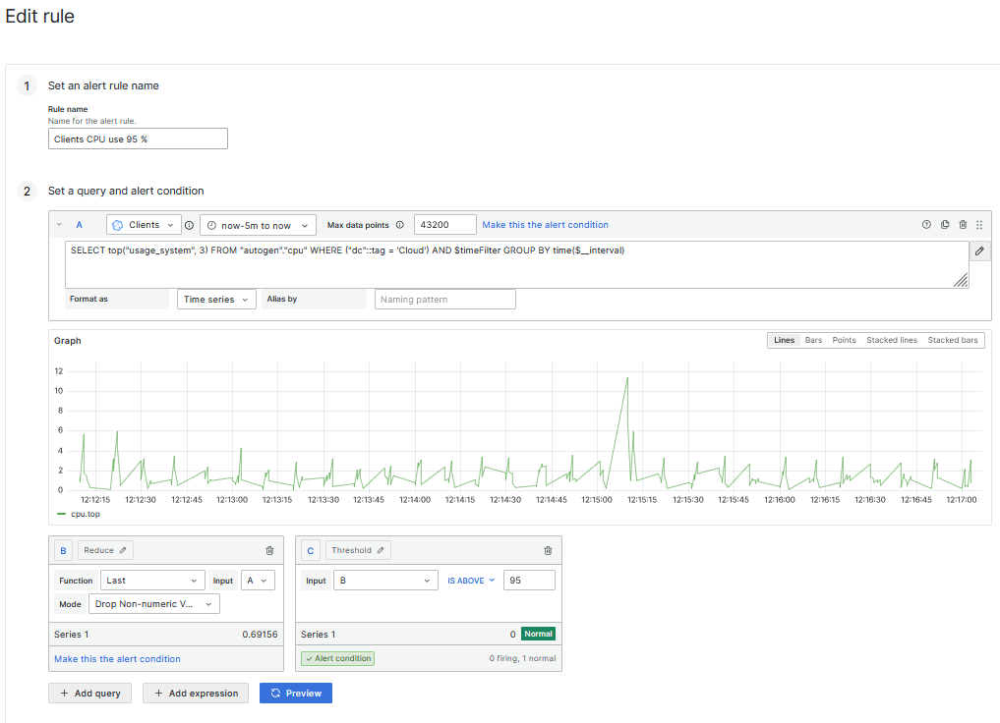
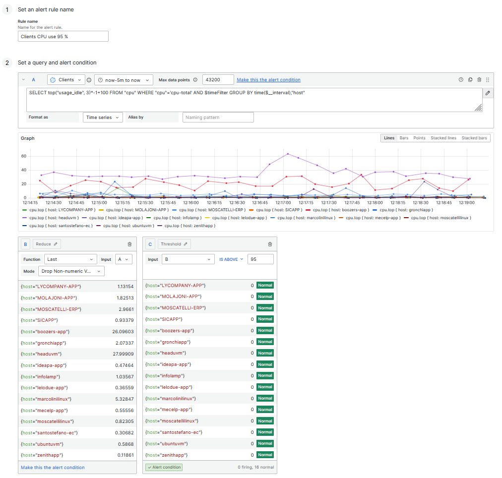
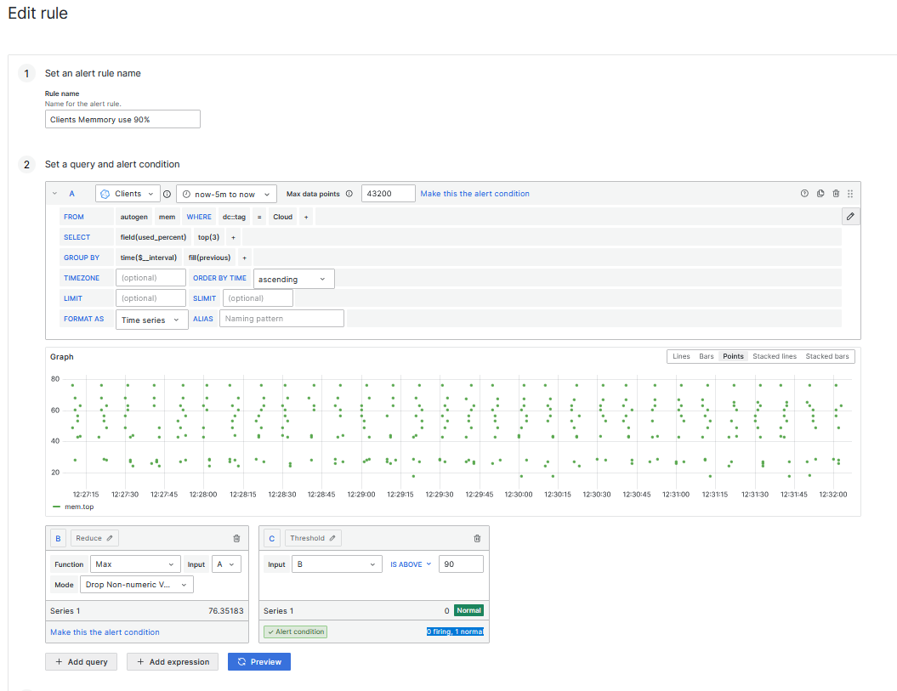
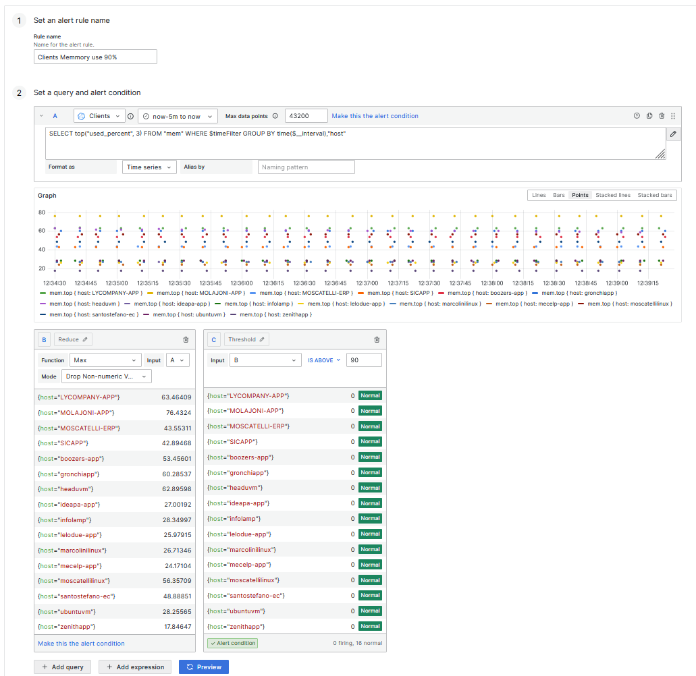
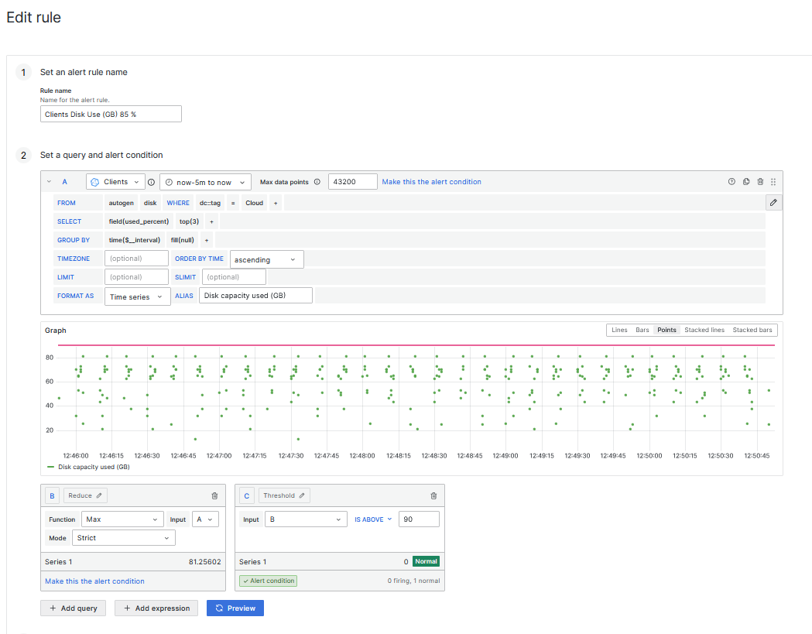
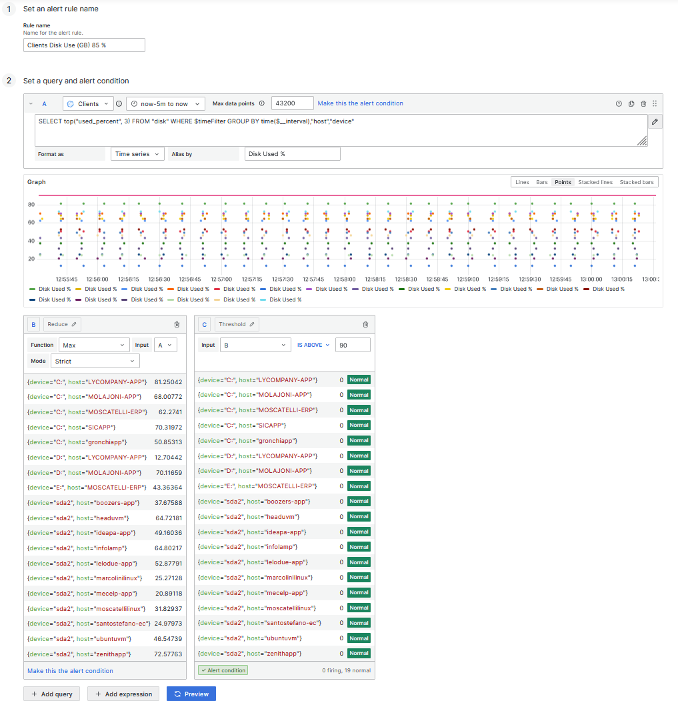

## Viejos scripts para Alertas
## CPU
SELECT top("usage_system", 3) FROM "autogen"."cpu" WHERE ("dc"::tag = 'Cloud') AND $timeFilter GROUP BY time($__interval)
### Aca se detecto que uno de los hosts (BAH, como siempre headu), se fue arriba del 95% y no se disparo la alerta, Generé un nuevo script con la experiencia que obtuve con el hosts map y aplique el nuevo script. Este parece mucho mas prometedor

### Antes:

### Despues
SELECT top("usage_idle", 3)*-1+100 FROM "cpu" WHERE "cpu"='cpu-total' AND $timeFilter GROUP BY time($__interval),"host"

## Memoria
### Igual, en el primer caso se ve el script generado por la consola grafica, despues se ve el nuevo generado con la experiencia obtenida

### Antes:
SELECT top("used_percent", 3) FROM "autogen"."mem" WHERE ("dc"::tag = 'Cloud') AND $timeFilter GROUP BY time($__interval) fill(previous)

### Despues:
SELECT top("used_percent", 3) FROM "mem" WHERE $timeFilter GROUP BY time($__interval),"host"

## Disco
### Nuevamente, ocurre lo mismo

### Antes 
SELECT top("used_percent", 3) FROM "autogen"."disk" WHERE ("dc"::tag = 'Cloud') AND $timeFilter GROUP BY time($__interval) fill(null)

### Despues:
